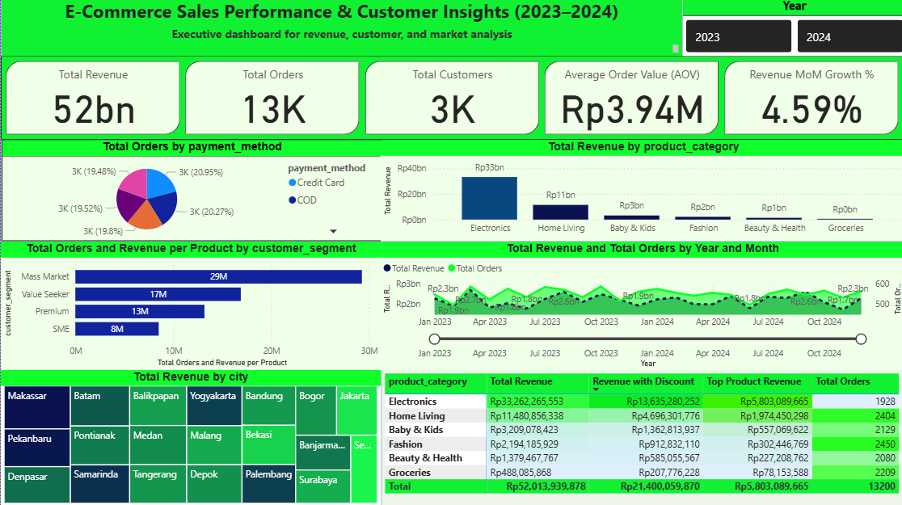
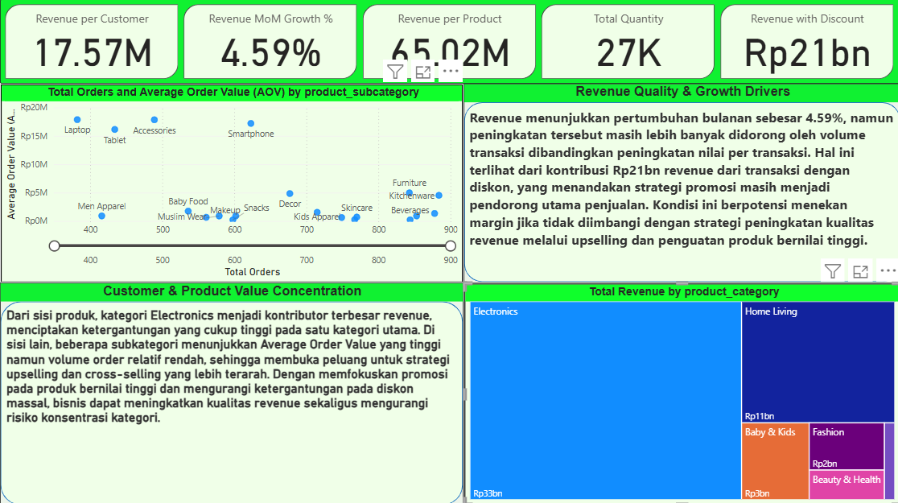

# E-Commerce Sales Performance & Customer Insights  

---

## Project Overview
This project analyzes **e-commerce sales performance**  using a **Power BI dashboard**.  
The analysis focuses on **revenue growth quality**, **discount dependency**, and **product value concentration** to support **data-driven business decision-making**.

Rather than reporting surface-level metrics, this project emphasizes **why revenue grows**, **how sustainable the growth is**, and **where optimization is required**.

---

## Dashboard & Visualization

---
### Dashboard Business Health Overview

This dashboard provides a high-level view of overall business performance, enabling stakeholders to quickly assess the health and stability of the e-commerce operation. It highlights key growth drivers, revenue distribution, and market coverage to support strategic monitoring and executive decision-making. By consolidating performance indicators into a single view, the dashboard helps identify early signals of risk, dependency, and growth opportunities, ensuring that business decisions are informed by a clear and structured understanding of operational performance.

### Dashboard Customer & Product Value

This dashboard focuses on understanding who and what drives business value by analyzing customer behavior and product contribution. It supports data-driven decisions related to customer prioritization, product optimization, and value-based growth strategies. By emphasizing value creation rather than volume alone, the dashboard helps stakeholders identify high-impact customer segments and products that are essential for building sustainable and long-term business performance.

---
### Tools Used
- **Power BI** ,**SQL**
  
---

## Business Objectives
The objectives of this analysis are to:
- Evaluate whether revenue growth is **volume-driven or value-driven**
- Measure the **impact and dependency of discounts** on total revenue
- Identify **product categories and subcategories** that dominate revenue
- Highlight opportunities to improve **Average Order Value (AOV)** and **customer value**
- Provide actionable insights to support **sustainable business growth**

---

## Business Context
The business operates as a **multi-category e-commerce platform in Indonesia**, offering products across:
- Electronics  
- Home Living  
- Fashion  
- Beauty & Health  
- Baby & Kids  
- Groceries  

The platform applies promotional discounts to stimulate demand and uses multiple payment methods.  
While revenue growth is positive, management requires deeper insights into **revenue quality**, **product dependency**, and **promotion effectiveness**.

---

## Dataset Description
The analysis is based on transactional-level data structured into the following entities:

### Transactions
- Order ID  
- Order Date  
- Product Category  
- Product Subcategory  
- Quantity Sold  
- Revenue  
- Discount  
- Payment Method  

### Customers
- Customer ID  
- Total Orders per Customer  
- Revenue per Customer  

### Products
- Product Category  
- Product Subcategory  
- Revenue per Product  

---

## Key Metrics (North Star Metrics)

### Sales & Growth Metrics
- **Total Revenue:** Rp52 billion  
- **Revenue MoM Growth:** 4.59%  
- **Total Orders:** 13,000  
- **Total Quantity Sold:** 27,000 units  
- **Average Order Value (AOV):** Rp3.94 million  

### Revenue Quality Metrics
- **Revenue with Discount:** Rp21 billion  
- **Revenue per Customer:** Rp17.57 million  
- **Revenue per Product:** Rp65.02 million  

---

## Insights & Findings

### 1. Revenue Growth Is Primarily Volume-Driven
Despite a positive monthly revenue growth of **4.59%**, the growth is largely driven by **transaction volume** rather than increased order value.  
With **13,000 orders** and **27,000 units sold**, the relatively stable AOV indicates that revenue expansion still depends on higher transaction volume, which may increase operational costs over time.

---

### 2. High Dependency on Discounted Sales
Revenue generated from discounted transactions reaches **Rp21 billion**, representing approximately **40.4% of total revenue**.  
This indicates that nearly **two-fifths of total revenue** relies on promotional pricing, creating potential margin pressure if discount strategies are not carefully managed.

---

### 3. Revenue Concentration in the Electronics Category
The **Electronics** category contributes approximately **Rp33 billion**, accounting for around **63–64% of total revenue**.  
While this category is the primary revenue driver, such concentration increases business risk and highlights the need for category diversification.

---

### 4. Untapped Opportunity in High-Value Subcategories
Several product subcategories show **high average order value** but **lower transaction volume**.  
This suggests an opportunity to grow revenue through **targeted upselling and personalized promotions** without significantly increasing order volume.

---

## Business Recommendations

1. **Improve Revenue Quality**  
   Shift focus from pure volume growth toward strategies that increase **AOV**, such as upselling and product bundling.

2. **Optimize Discount Strategy**  
   Apply discounts selectively by category or subcategory and reduce promotional intensity on high-demand products.

3. **Reduce Category Dependency**  
   Leverage traffic from Electronics to drive **cross-selling** into Home Living and Beauty & Health categories.

4. **Maximize High-Value Products**  
   Launch targeted campaigns for subcategories with high AOV but lower purchase frequency.

---

### Dashboard Features
- Global slicers: Year, Product Category, City  
- KPI cards for revenue, growth, AOV, and discount contribution  
- Key visuals include:
  - Monthly revenue trend
  - Revenue by category and subcategory
  - AOV vs total orders (scatter analysis)
  - Discounted vs non-discounted revenue
  - Revenue distribution by city  

---

## Key Takeaway
Revenue growth alone does not fully represent business health.  
By analyzing **revenue quality**, **discount dependency**, and **product concentration**, this project provides insights that support **more sustainable and strategic decision-making**.

---

## Portfolio Note
This project was developed as part of a **Data Analyst / Business Analyst portfolio**, demonstrating:
- Business-oriented thinking  
- Metric-driven analysis  
- Clear linkage between data, insights, and recommendations  

